# Ember — Restaurant Management System

> Full-stack system that runs a restaurant end to end: interactive floor plan, reservations with email confirmation, kitchen order queue, waiter stations and end-of-day cash close. Built for a real venue.

## Screenshots

**Login & live dashboard**

<p>
  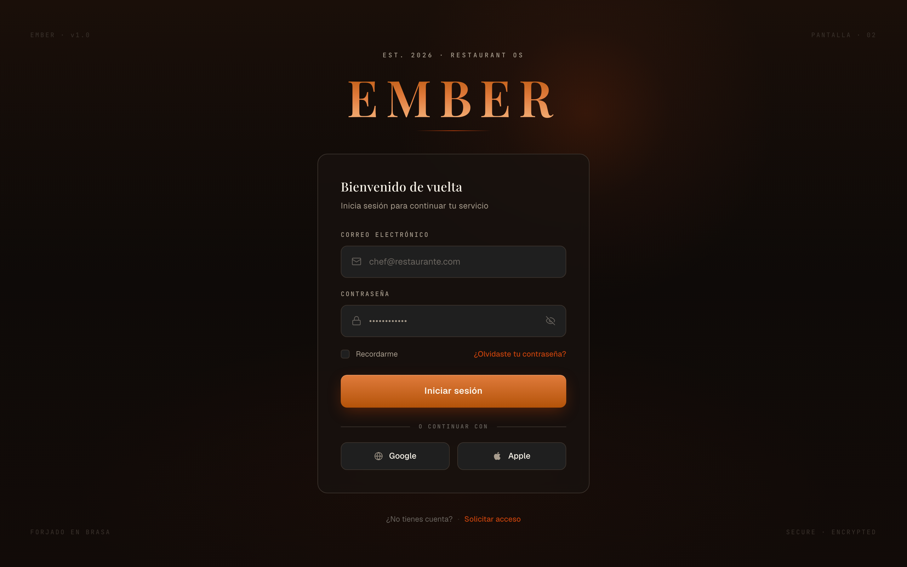
  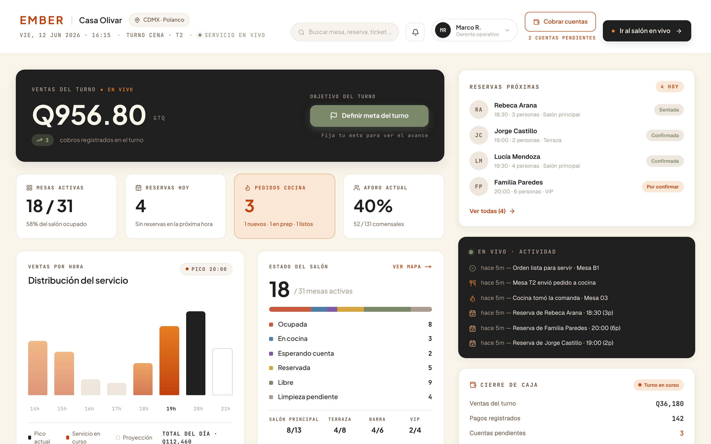
</p>

**Floor plan — live view & editor**

<p>
  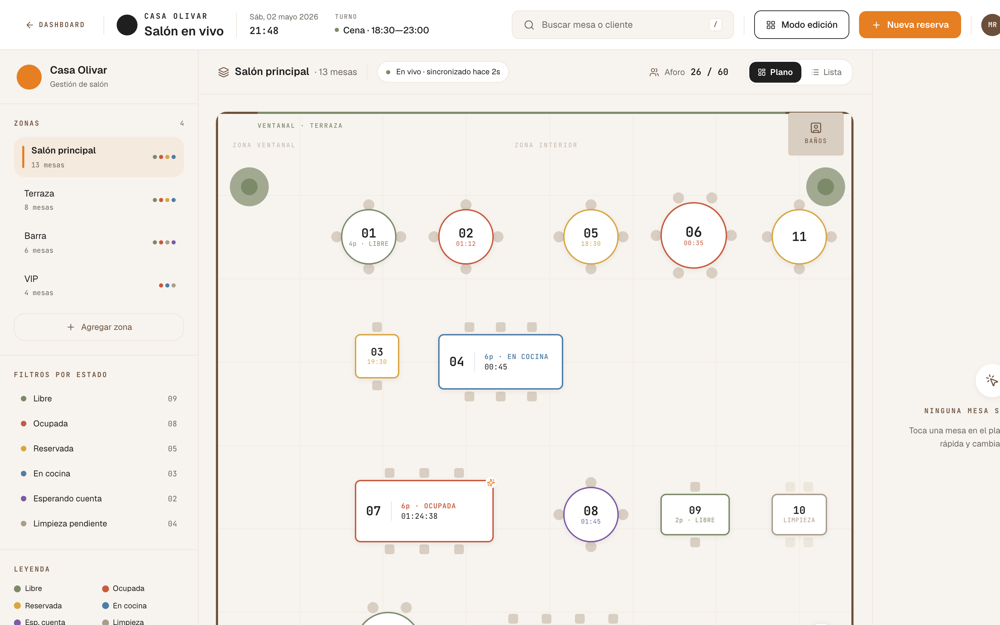
  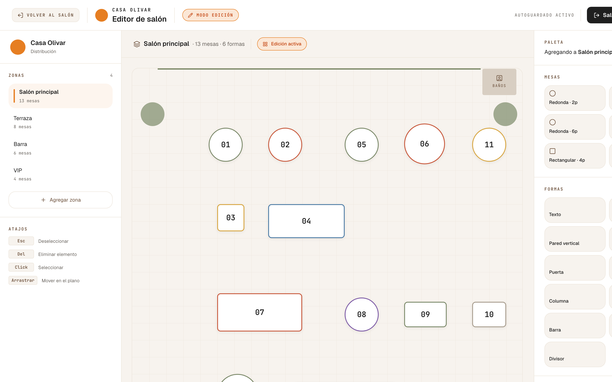
</p>

**Waiter station — table map & order taking**

<p>
  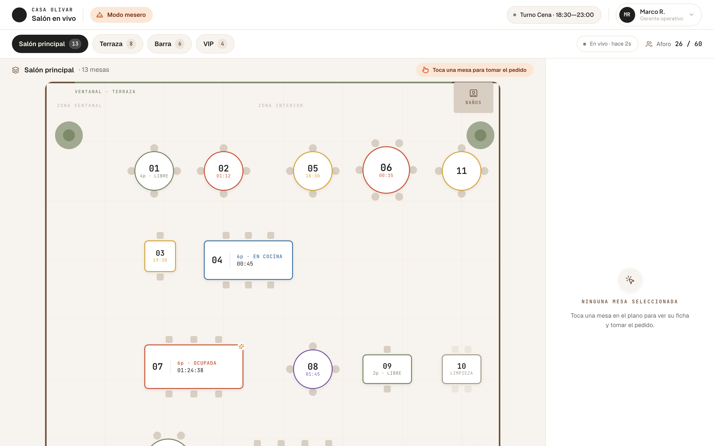
  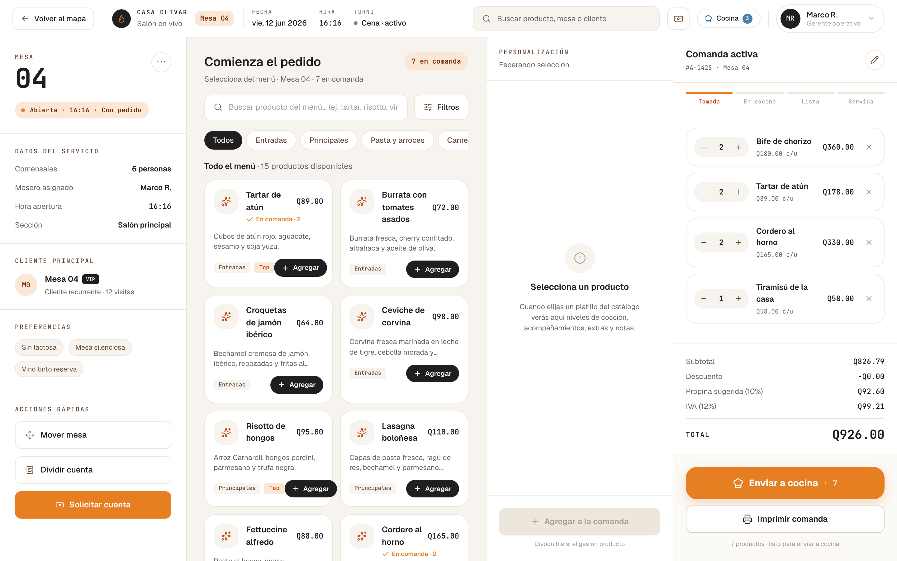
</p>

**Kitchen display & reservation wizard**

<p>
  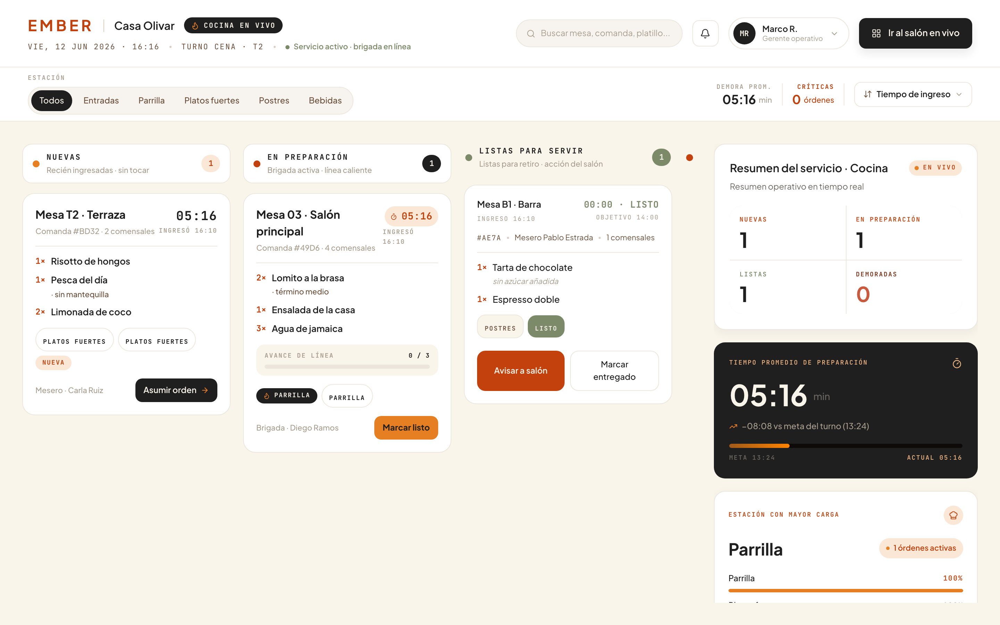
  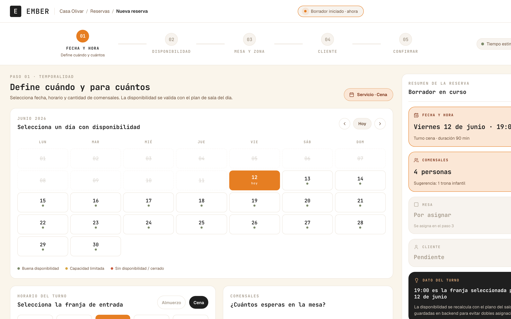
</p>

**Cash register — charging & end-of-day close**

<p>
  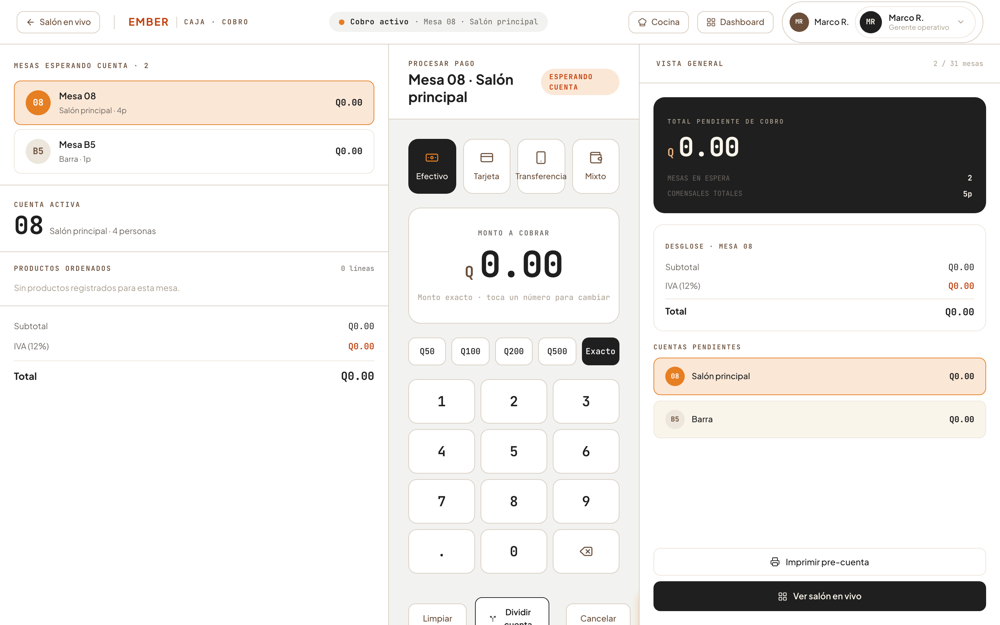
  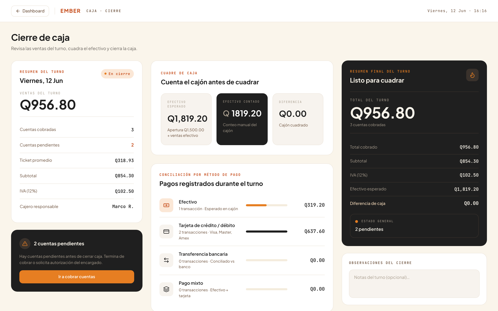
</p>

**Node status monitor & PIN lock screen**

<p>
  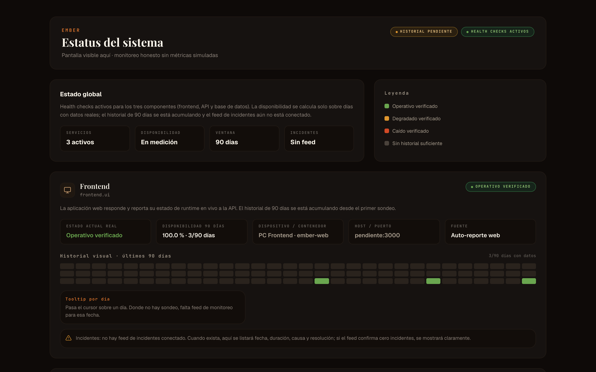
  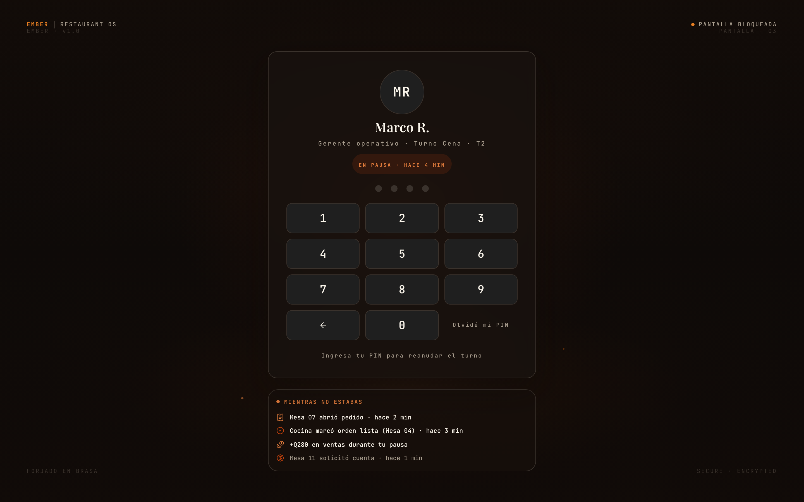
</p>

## What it does

- **Salón** — visual floor-plan editor with live table states (`/salon`)
- **Reservations** — booking flow with SMTP email confirmations (`/reservas`)
- **Kitchen screen** — live order queue for the kitchen (`/cocina`)
- **Waiter mode** — per-table order taking (`/mesero`)
- **Cash register** — sales tracking and end-of-day cash close (`/caja`)
- **Dashboard & node status** — business overview and infrastructure health monitor (`/dashboard`, `/status`)
- **Auth & roles** — Auth.js v5 sessions, Argon2 password hashing, role-based access and a lock screen for shared devices

## Tech stack

| Layer | Technology |
|---|---|
| Front-end | Next.js 16 (App Router) · React 19 · TypeScript · Tailwind CSS |
| API | Hono (Node.js) · Zod validation |
| Data | PostgreSQL · Drizzle ORM — 10 versioned SQL migrations |
| Auth | Auth.js (next-auth v5) · Argon2 password hashing |
| Email | Nodemailer (SMTP) |
| Infra | Docker & Docker Compose (dev and prod targets) · pnpm workspaces |

## Architecture

- **Two deployable services** — the Next.js web app (`src/`) and a Hono REST API (`api/`), wired together with Docker Compose
- **Distributed on-prem install** — web, API and database can run on separate machines on the venue's LAN; the `/status` page monitors the identity and health of every node (see `.env.example`)
- **Typed module boundaries** — `api/src/modules/{kitchen,reservations,sales,salon,staff,status}`, with Zod-validated inputs
- **Versioned schema** — Drizzle SQL migrations plus seed scripts in `api/scripts/`

## Getting started

```bash
cp .env.example .env    # set AUTH_SECRET → openssl rand -base64 32
pnpm docker:dev         # web :3000 · api :3001 · postgres :5432
```

Useful scripts: `pnpm docker:build`, `pnpm docker:logs`, `pnpm docker:down`, `pnpm docker:prod`. Database seed scripts live in `api/scripts/`.

## License & usage

**© 2026 Anthony Anderson Herrera Aguirre. All rights reserved.**

This source code is published **for portfolio review only** — you are welcome to read it, but it may not be used, copied, modified or redistributed. See [LICENSE](LICENSE).

## Author

**Anderson Aguirre** — Front-End Developer (React · TypeScript)

📫 andersonaguirre794@gmail.com · [LinkedIn](https://www.linkedin.com/in/anthony-aguirre-44585a376/) · [GitHub](https://github.com/imanderrrrr)
